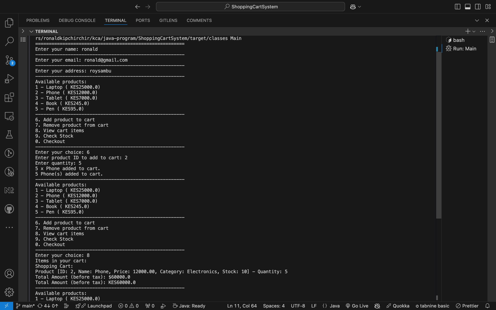
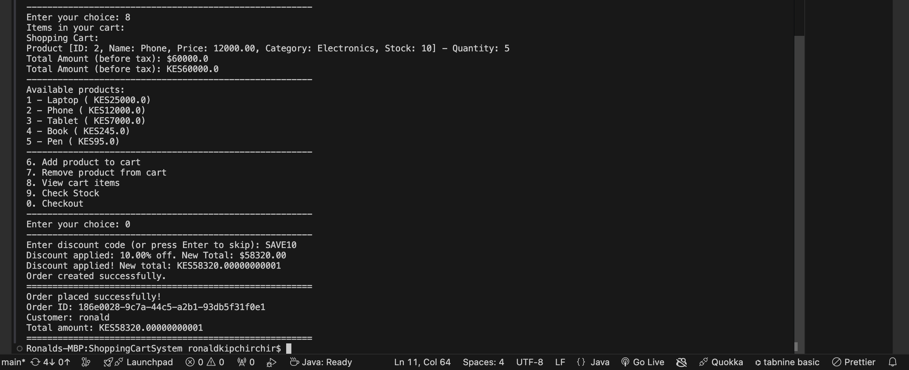

<h1>Online Shopping Cart System</h1>
A Java-based application for an intuitive online shopping experience.

<h2>Table of Contents</h2>
<ul>
<li><a href="#about">About the Project</a></li>
        <li><a href="#features">Features</a></li>
        <li><a href="#installation">Installation</a></li>
        <li><a href="#usage">Usage</a></li>
        <li><a href="#output">Application Output</a></li>
        <li><a href="#technologies">Technologies Used</a></li>
        <li><a href="#contributing">Contributing</a></li>
        <li><a href="#license">License</a></li>
    </ul>
<h2 id="about">About the Project</h2>
    
The <strong>Online Shopping Cart System</strong> is a Java-based console application designed to mimic the functionalities of a real-world e-commerce platform. It allows users to add items to a cart, apply discounts, calculate totals, and generate order confirmations.

<h2 id="features">Features</h2>
    <ul>
        <li>Add items to the shopping cart</li>
        <li>Remove items from the cart</li>
        <li>Calculate the total price with applicable taxes (8%)</li>
        <li>Apply discount codes</li>
        <li>Check product stock availability</li>
        <li>Generate an order confirmation summary</li>
    </ul>

<h2 id="installation">Installation</h2>
    
Follow these steps to set up the project:

    <ol>
        <li>Clone the repository:
            <pre>
                <code>git clone &lt;repository-url&gt;</code>
            </pre>
        </li>
        <li>Open the project in your preferred IDE (e.g., VS Code or IntelliJ IDEA).</li>
        <li>Run the <code>Main.java</code> file to start the application.</li>
    </ol>

<h2 id="usage">Usage</h2>
    
Once the application is running, users will be presented with a menu-driven interface:

    <ol>
        <li>Add items to the cart by selecting a product ID and quantity.</li>
        <li>View or modify cart items at any time.</li>
        <li>Apply discount codes (e.g., <code>SAVE10</code>) for eligible promotions.</li>
        <li>Proceed to checkout to calculate totals and receive an order confirmation.</li>
    </ol>

<h2 id="output">Application Output</h2>
    
Below are some screenshots of the application's output:

<h3>Main Menu</h3>
    
    

<h2 id="technologies">Technologies Used</h2>
    <ul>
        <li><strong>Java</strong> - Core programming language</li>
        <li><strong>JUnit</strong> - For unit testing</li>
        <li><strong>Git</strong> - Version control</li>
        <li><strong>Markdown</strong> - For documentation</li>
    </ul>

<h2 id="contributing">Contributing</h2>
    
Contributions are welcome! Follow these steps:

<ol>
        <li>Fork the repository</li>
        <li>Create a new branch:
            <!-- <pre> -->
            <code>git checkout -b feature/your-feature-name</code>
            <!-- </pre> -->
        </li>
        <li>Commit your changes:

<code>git commit -m "Add your message"</code>
</li>
<li>Push the branch:
            <!-- <pre> -->
<code>git push origin feature/your-feature-name</code>
            <!-- </pre> -->
        </li>
        <li>Open a pull request</li>
    </ol>

<h2 id="license">License</h2>

This project is licensed under the <strong>Apache License</strong>. See the LICENSE file for details.

<footer style="text-align:center;">
        
Developed with ❤️ by the Online Shopping Cart System Team

    </footer>
